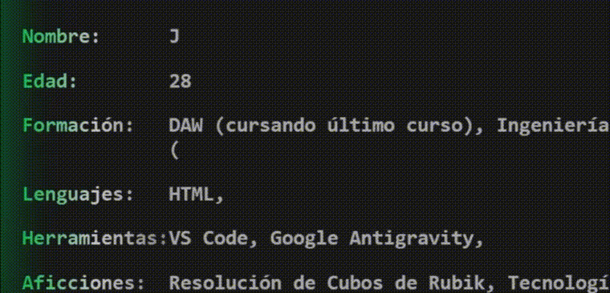
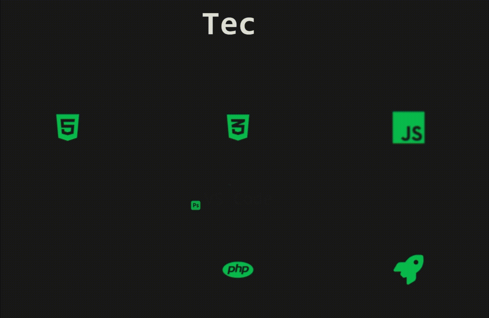

# ¡Hola! Soy Jairo! 👋

---

Este repositorio está dedicado a mi Portfolio personal con diseño responsive tanto para escritorio como para dispositivos móviles. En este se encuentra información y enlaces directos tanto a mis proyectos personales en desarrollo como información de contacto. Este proyecto se encuentra en su versión 1.0 no definitiva, por tanto se irá actualizando con el tiempo.

## Entra ya en: https://jairocarrasco97.github.io/Portfolio/ 

---

Esta web responsive contiene información básica sobre mí y mis proyectos. La intención de este proyecto es visualizar y centralizar mi trabajo para que sea de fácil acceso. A su vez dar información de contacto, tanto correo electrónico, GitHub y Linkedin. La idea original de la web una interfaz sencilla e intuitiva con la intención de llamar la atención del consumidor con pequeñas animaciones dinámicas. De esta idea original se consiguió la siguiente interfaz:  

Escritorio:

Móvil:

  

La interfaz de bienvenida incorpora una animación de saludo visualizado a través del propio icono 👋. Tras ello, un pequeño slice con información básica e iconos de contacto y descarga de currículum.

Todas las animaciones de Typing se renderizan con una función centralizada ideada con la siguiente intención:

- Escritura de un intervalo entre pulsaciones de teclas aleatorio: El script calcula un Delay aleatorio entre 10 y 550ms para simular una escritura realista. pulsaciones de teclas rápidas y lentas simulan cuando un usuario pulsa teclas mas lejanas, o teclas que son mas cercanas entre sí o más comunes.
- Error de letra: La escritura comete un error con una probalidad de 0.125 (12,5%), simplemente este error escribe la letra siguiente en vez de la que tocaría en ese índice. En la siguiente interacción se corrige y continúa el bucle.
- Borrado de texto: Tras completar el texto inicialmente ideado, se ejecuta una función complementaria para eliminar todo el texto anteriormente escrito también con un delay aleatorio entre 10 y 400ms.
- Cursor de inserción: se incorpora el cursor "|" para un mayor realismo.

  

Las tecnologías usadas en mis proyectos se representan con una animación mostrando el icono y el nombre de la misma. 

  

